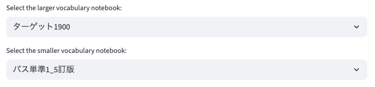
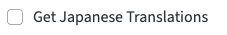
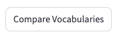
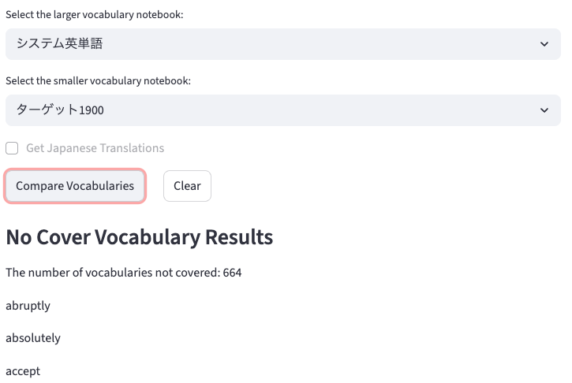
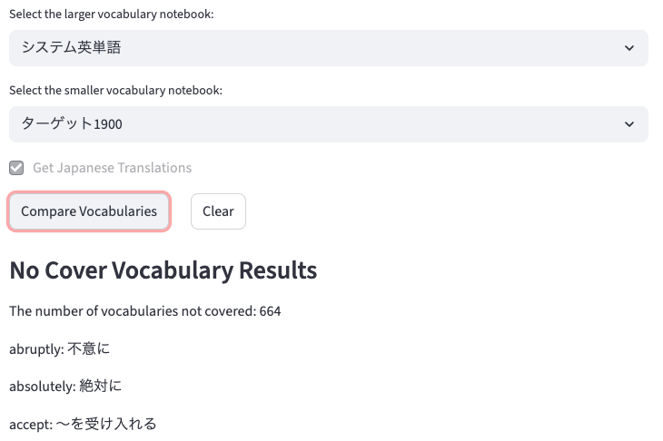

# No Cover Vocabulary

## Overview

I created this application based on inquiry from Y.H.
This application compares 2 vocabulary notebooks and extracts words that are included in one notebook but not the other.
The basic feature depends on `Streamlit`, a useful frontend framework available for python.

## Directory structure

```
.
├── backend
│   ├── data
│   │   ├── ...
│   │   └── any_word_notebooks_data.csv
│   └── modules
│       ├── __init__.py
│       └── app.py
├── frontend
│   └── app.py
├── README.md
└── requirements.txt
```

## How to use

Please access [here](https://no-cover-vocabulary.streamlit.app/).

### Select vocabulary notebooks

Choose 2 notebooks you want to investigate.


### Check Japanese translation

If you want to confirm Japanese translation for each word as well, please check the following checkbox.


### Click the "Compare Vocabularies" button to confirm the results

You can run app by clicking the following button.

And you can see the results for execution.
The following is one of the examples.


---
If you have checked Japanese translation checkbox, you can see the Japanese translations like below;


### Click the "Clear" button if needed

If you click the "Clear" button, you can remove all results and execute again.

## Available Vocabulary Notebooks

- ターゲット1900 6訂版
- システム英単語 5訂版
- LEAP改訂版
- パス単準1 5訂版

## Vocabulary Notebooks data requirements

It should be an independent csv file, and it exist for each vocabulary notebooks.
This means there should not exist more than 2 vocabulary notebooks that have the same name.
The structure should be like below;

```csv
Revised,Number,Vocabulary,Meaning
,1,apple,りんご
新,2,banana,バナナ
...
```

## Inquiries & Reports

If you would like to propose new features, or find some bugs, please let me know.
You can report anything by using [this issue page](https://github.com/sora-tt/no-cover-vocabulary/issues).

## For developer 
- python.analysis.typeCheckingMode
- general rule
    - Please make sure to create **an issue and a pull request** even though your change is small enough.
