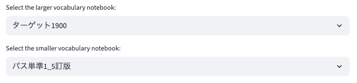
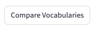
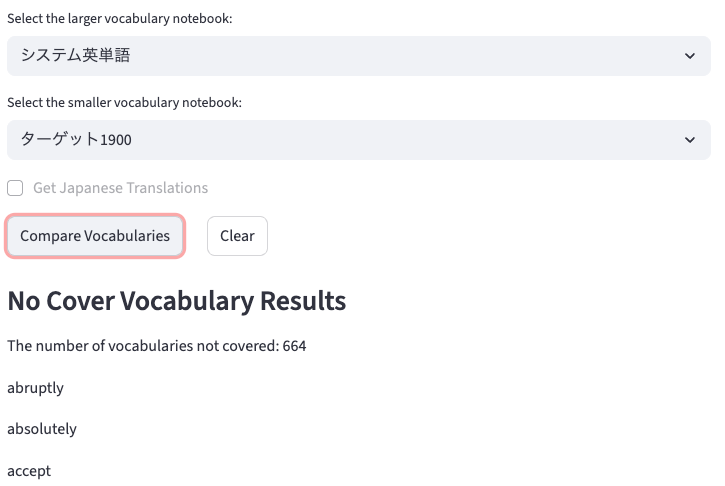
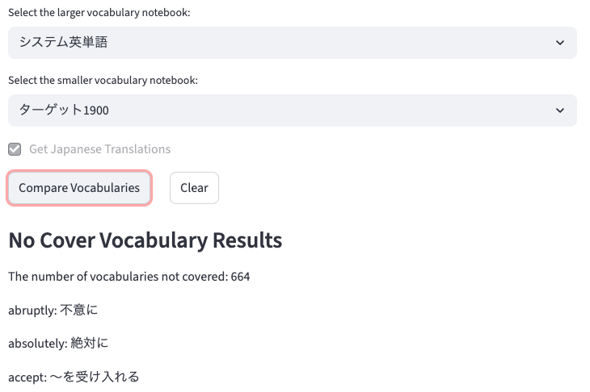

# No Cover Vocabulary

## Overview

I created this application based on inquiry from Y.H.
This application compares 2 vocabulary notebooks and extracts words that are included in one notebook but not the other.
The basic feature depends on `Streamlit`, a useful frontend framework available for python.

## Directory structure

```
.
├── backend
│   ├── data
│   │   ├── ...
│   │   └── any_word_notebooks_data.csv
│   └── modules
│       ├── __init__.py
│       └── app.py
├── frontend
│   └── app.py
├── README.md
└── requirements.txt
```

## How to use

Please access [here](https://no-cover-vocabulary.streamlit.app/).

### Select vocabulary notebooks

Choose 2 notebooks you want to investigate.
e.g. If you set ターゲット1900 (referred T from below) as the larger vocabulary notebook, and パス単準1_5訂版 (referred P from below) as the smaller one, this app extracts words from T, which is not described in P.


### Check Japanese translation

If you want to confirm Japanese translation for each word as well, please check the following checkbox.


### Click the "Compare Vocabularies" button to confirm the results

You can run app by clicking the following button.



And you can see the results for execution.
The following is one of the examples.



---
If you have checked Japanese translation checkbox, you can see the Japanese translations like below;



### Click the "Clear" button if needed

If you click the "Clear" button, you can remove all results and execute again.

## Available Vocabulary Notebooks

- ターゲット1900 6訂版
- システム英単語 5訂版
- LEAP改訂版
- パス単準1 5訂版

## Vocabulary Notebooks data requirements

It should be an independent csv file, and it exist for each vocabulary notebooks.
This means there should not exist more than 2 vocabulary notebooks that have the same name.
The structure should be like below;

```csv
Revised,Number,Vocabulary,Meaning
,1,apple,りんご
新,2,banana,バナナ
...
```

## How to execute this app from your local environment

### Requirements

Please make sure that your system has them.
```
brew (only for Mac)
git
```
(For windows users) I recommend to use WSL as a distribution.

Execute these commands in order on your terminal.
```sh
cd ~
mkdir dev
cd dev
git clone https://github.com/sora-tt/no-cover-vocabulary.git
cd no-cover-vocabulary
python3 -m venv env
source ./env/bin/activate
pip install --upgrade pip
pip install -r requirements.txt
streamlit run frontend/app.py
```
Then, browser will be opened automatically.

## Inquiries & Reports

If you would like to propose new features, or find some bugs, please let me know.
You can report anything by using [this issue page](https://github.com/sora-tt/no-cover-vocabulary/issues).

## For developer 
- python.analysis.typeCheckingMode
- general rule
    - Please make sure to create **an issue and a pull request** even though your change is small enough.

## Version update

### [v1.6.2] - 2025-09-15
- Update the browser title.

### [v1.6.1] - 2025-09-15
- Refactor condition flag used repeatedly.

### [v1.6.0] - 2025-09-15
- Add LEAP and パス単準1級 data.

### [v1.5.0] - 2025-09-15
- Add checkbox to see Japanese translation.

### [v1.4.0] - 2025-09-15
- Create the clear button.
- Add session management feature.

### [v1.3.0] - 2025-09-15
- Create select box for more simple UI.
- Add note for users to report issues.

### [v1.2.1] - 2025-09-15
- Fix import error of backend modules.

### [v1.2.0] - 2025-09-15
- Modulize backend to enable deployment.

### [v1.1.0] - 2025-09-15
- Implement frontend basic feature.

### [v1.0.0] - 2025-09-14
- Initial Release.
- Basic feature comparing 2 data.

---

# No Cover Vocabulary (Revamp version)

## How to use

TBU

## How to execute

Execute this command
```sh
git clone https://github.com/sora-tt/no-cover-vocabulary.git
cd no-cover-vocabulary
git checkout release/revamp-using-react-and-django
docker compose up --build
```
Then access to [http://localhost:3000/](http://localhost:3000/)
